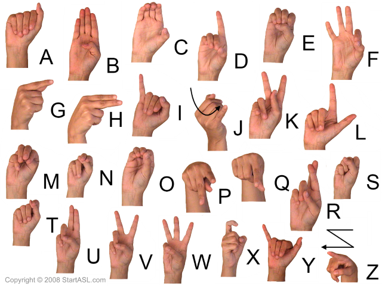
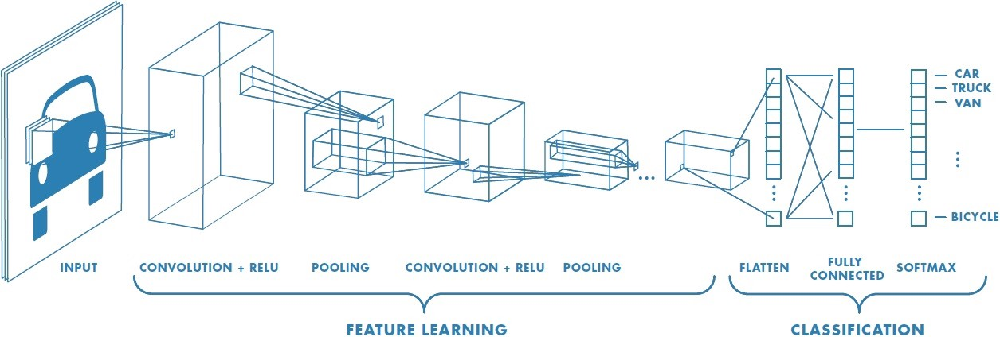
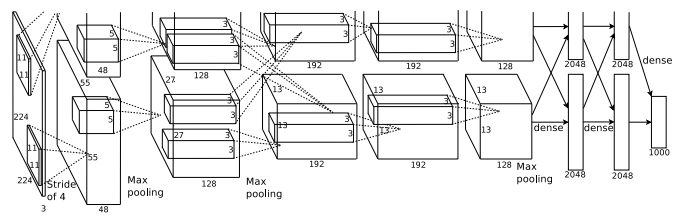
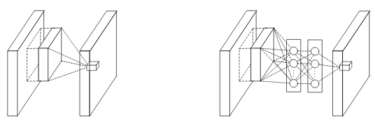
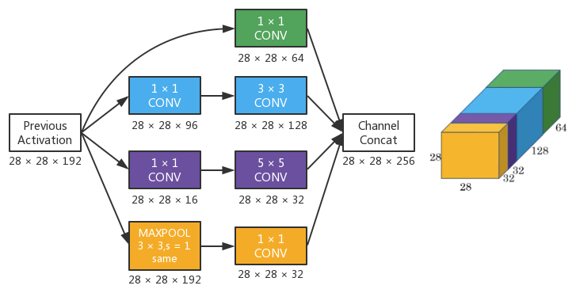
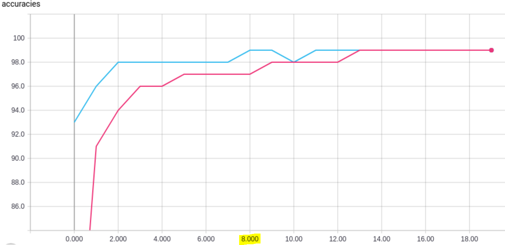
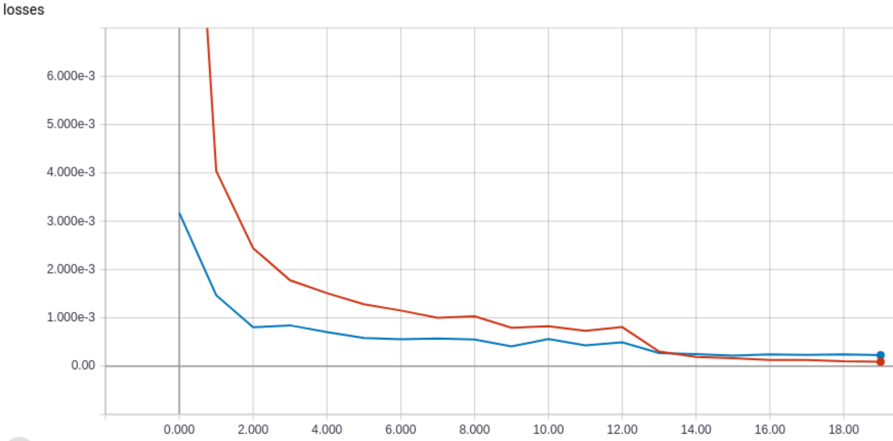
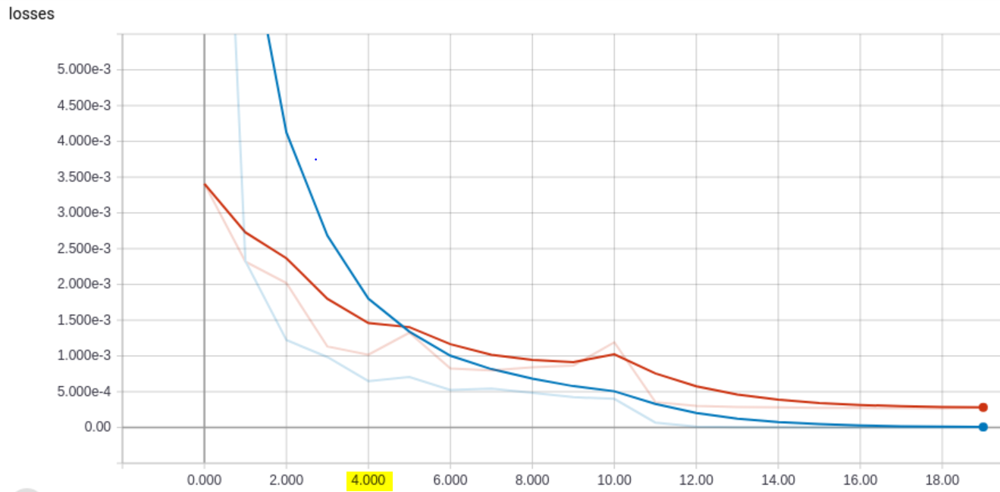
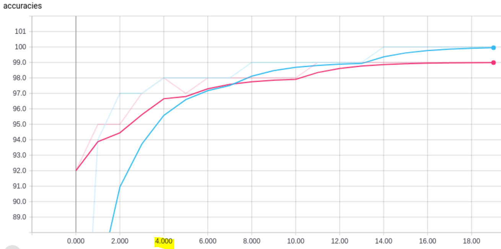

# Hand Gesture Classification

**Christian Braz, Junior Ovince, Rahul Seti**  
George Washington University — Department of Data Science

---

## Abstract

Hand gesture recognition is the process of recognizing meaningful expressions of form and motion by a human involving only the hands. There are plenty of applications where hand gesture recognition can be applied for improving control, accessibility, communication, and learning. In this work, we present our results in classifying twenty-six hand signs for the letters of the alphabet. We conduct experiments using different convolutional neural network architectures and report the performance of each of them.

**Keywords:** gesture recognition, machine learning, convolutional neural networks, deep learning

---

## Introduction

Hand gestures provide a complementary modality for expressing ideas. They can be used in many different contexts to augment human-machine interaction — for instance, to help deaf people communicate, send commands to an intelligent house system, and so on. There are mainly two ways to capture such interaction: via **Data-Glove** and the **vision approach**. The Data-Glove approach collects data from sensors attached to a glove mounted on the user's hand. It is accurate but inconvenient in many scenarios due to the required hardware. The vision approach has the advantage of hardware simplicity, but requires a large amount of image data to be processed in an attempt to produce a solution insensitive to adverse conditions like lighting, background, subject, and camera variations.

The **American Sign Language (ASL)** is a visual language incorporating gestures, facial expressions, and body movements. The **American Manual Alphabet (AMA)** is a manual alphabet that augments the vocabulary of ASL, composed of 26 hand positions designating letters A–Z and 10 positions for digits 0–9.

When using hand signs for letters to spell out a word, this is called "fingerspelling" — in AMA this is one-handed.

---

## Related Work

Hand gesture recognition without wearable devices has been the target of many research efforts. Trigueiros, Ribeiro, and Reis (2012) conducted a comparative study of k-NN, Naïve Bayes, ANN, and SVM for static gesture recognition, concluding that ANN delivered the best performance.

Strezoski et al. (2018) highlight how GPUs boosted deep learning architectures, particularly CNNs, which have proven superior for image processing problems. Garcia and Viesca (2016) propose an ASL fingerspelling translator based on CNN using transfer learning on a pre-trained GoogleLeNet to develop a real-time ASL recognition system. Bheda and Radpour (2017) tackle automatic sign language recognition using depth-sensing images.

---

## Literature Review

### Convolutional Neural Network

A CNN consists of convolutional and pooling layers, optionally followed by fully connected layers. The input to a convolutional layer is an $m \times m \times r$ image where $m$ is height/width and $r$ is the number of channels. The convolutional layer has $k$ filters of size $n \times n \times q$ which produce $k$ feature maps of size $m - n + 1$. Higher-level layers are fully connected (MLP) layers that classify the input using a softmax activation.

### The LeNet Architecture

Yann LeCun's **LeNet5** (1994) demonstrated that image features are distributed across the entire image and that convolutions with learnable parameters effectively extract features at multiple locations. Designed for handwritten digit recognition, LeNet5 processes 32×32×1 images through two convolutional layers and three fully connected layers.

### AlexNet

AlexNet, winner of ILSVRC-2010, employed 11×11, 5×5, and 3×3 convolutions, max pooling, dropout, and ReLU activations after every layer. It was trained on two Nvidia GeForce GTX 580 GPUs.

### VGG Net

Simonyan and Zisserman (2014) proposed increasing network depth using very small 3×3 convolution filters in all layers, with max-pooling over 2×2 pixel windows. They train architectures of 11–19 layers and 133–144 million parameters.

### GoogleLeNet

Winner of ILSVRC 2014 with a top-5 error rate of **6.67%**, GoogleLeNet is a 22-layer architecture using **Inception modules** — stacks of feature maps with 1×1 convolutions to reduce dimensionality before expensive 3×3 and 5×5 convolutions.

---

## Methods

### A. Pretraining

- **Normalization:** Applied 0.5 normalization via PyTorch `ImageFolder` to scale values to $[-1, +1]$.
- **Dataset split:** 70/15/15 train/validation/test split using scikit-learn, keeping all 29 classes balanced.

### Network Architecture Summary

| | Baseline | LeNet | AlexNet |
|---|---|---|---|
| **Conv layers** | 2 conv (5,5) | 2 conv (5,5) | 5 conv (11,5,3,3,3) |
| **Fully connected** | 1 (250 neurons) | 2 (120, 84 neurons) | 2 (4096, 4096) |
| **Output activation** | LogSoftmax | Linear | Linear |
| **Parameters** | 11M | 4.2M | 103M |
| **Feature maps** | 230 | 114 | 250k |

### B. Training

- **Loss:** Cross-entropy
- **Optimizer:** Adam
- **Regularization:** Xavier Normal initialization, learning rate scheduler, dropout, early stopping
- **Epochs:** 20 (initial benchmark)

### C. Post Training

Metrics used: confusion matrix, precision, recall, F-score, AUC, ROC. Tools: **PyTorch** and **TensorBoard**.

---

## Results

### 1. Baseline

The baseline model performs well up to the **10th epoch**, after which it overfits.

| Metrics | Initial (20 epochs) | Final (10 epochs) |
|---|---|---|
| Precision | 0.99595 | 0.9916846 |
| Recall / Accuracy | 0.99593 | 0.9916475 |
| F-score | 0.99594 | 0.9916470 |
| AUC | All > 0.9999 | All > 0.9998 |
| Processing Time | 36 minutes | 19 minutes |
| Stopped at epoch | 20 | 10 |

### 2. LeNet

The LeNet model overfits at the **4th epoch**.

| Metrics | Initial (20 epochs) | Final (4 epochs) |
|---|---|---|
| Precision | 0.996112 | 0.976701 |
| Recall / Accuracy | 0.996091 | 0.975785 |
| F-score | 0.996091 | 0.975852 |
| AUC | All > 0.9801 | All > 0.9603 |
| Processing Time | 30 minutes | 7 minutes |
| Stopped at epoch | 20 | 4 |

### 3. AlexNet

Run for only **5 epochs** due to high computational cost (45 minutes). Exhibits overfitting.

| Metrics | Initial (5 epochs) |
|---|---|
| Precision | 0.989630 |
| Recall / Accuracy | 0.989272 |
| F-score | 0.989259 |
| AUC | All > 0.9949 |
| Processing Time | 44 minutes |
| Stopped at epoch | 5 |

### 4. Model Testing

| Metrics | Baseline (10 epochs) | LeNet (4 epochs) |
|---|---|---|
| Precision | 0.9902369 | 0.9794684 |
| Recall / Accuracy | 0.9901915 | 0.9786973 |
| F-score | 0.9901984 | 0.9787579 |
| AUC | All > 0.9998 | All > 0.9596 |
| Processing Time | 18 minutes | 7 minutes |
| Classes with lowest accuracy | S, A, B, del | G, P, Space, B |

---

## Conclusion

A two-convolutional-layer network is sufficient for this dataset. The **Baseline model** outperforms LeNet in accuracy; **LeNet** classifies at ~98% accuracy nearly 2.5× faster. A combination or ensemble of both architectures could further improve performance. Very little hyperparameter tuning was performed — adjusting neurons, batch size, and weight regularization could yield further improvements.

---

## References

Bheda, V., & Radpour, D. (2017). Using deep convolutional networks for gesture recognition in American Sign Language. *CoRR, abs/1710.06836*.

Garcia, B., & Viesca, S. (2016). Real-time American Sign Language recognition with convolutional neural networks. Stanford.

Lin, M., Chen, Q., & Yan, S. (2013). Network in network. *CoRR, abs/1312.4400*.

Simonyan, K., & Zisserman, A. (2014). Very deep convolutional networks for large-scale image recognition. *CoRR, abs/1409.1556*.

Strezoski, G., Stojanovski, D., Dimitrovski, I., & Madjarov, G. (2018). Hand gesture recognition using deep convolutional neural networks. In *ICT Innovations 2016* (pp. 49–58). Springer.

Szegedy, C., et al. (2014). Going deeper with convolutions. *CoRR, abs/1409.4842*.

Trigueiros, P., Ribeiro, F., & Reis, L. P. (2012). A comparison of machine learning algorithms applied to hand gesture recognition. In *CISTI 2012* (pp. 1–6).
